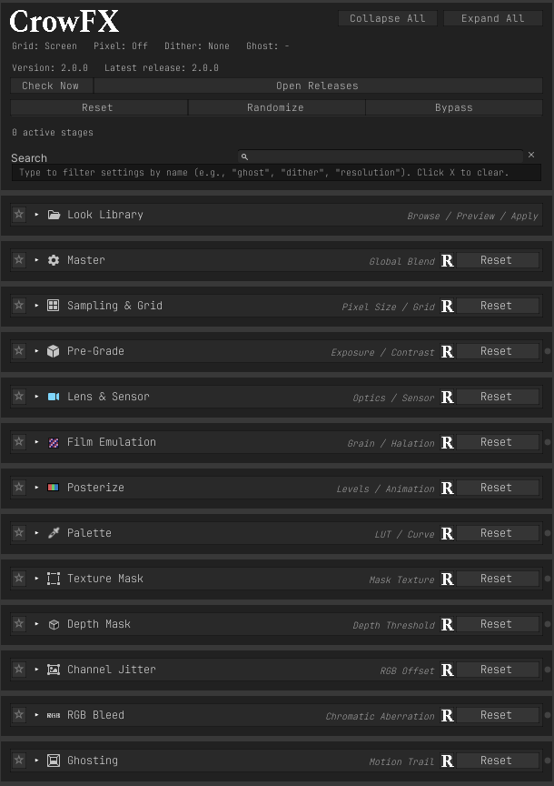
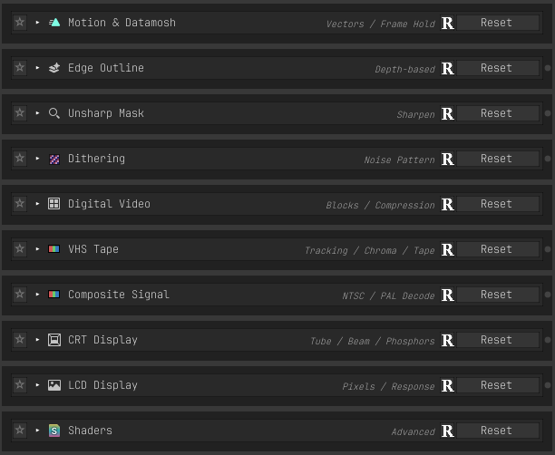

# The inspector

   
  

## Layout

The component exposes 255 settings, so the inspector is built around finding things rather than
scrolling. Every section can be collapsed, starred as a favorite, and searched by name or by what it
does.

The tinted panel at the top holds the global actions — Reset, Randomize, and Bypass — kept visually
separate because they overwrite or disable the whole stack. Beneath it, a strip of pills reports
which stages are actually rendering.

## Section header controls

| Control | Purpose |
|---|---|
| ★ | Add the section to favorites |
| ? | Reveal that section's explanatory notes |
| Randomize | Randomize only this section |
| Reset | Restore this section's defaults |
| Status dot | Lit when the section contributes to the render |

Explanatory notes are hidden by default and toggled per section with the `?` button. Warnings,
errors, fix-it prompts, and look descriptions are never hidden — they always show regardless.

## Solo, Mute, and Bypass

**Solo** isolates one section: everything else is temporarily neutralized so you can see what that
stage alone contributes. Soloing a section that is switched off turns it on for the duration.

**Mute** temporarily neutralizes a single section, leaving everything else running.

**Bypass** disables the whole component.

All three are preview states. They restore the original values when released, when the inspector
closes, and before entering Play Mode, so a preview can never become a runtime setting. None of them
alters what is saved.

Because they restore a remembered value, all three require a single selected component.

## Live previews

Each section can show a live preview that runs that stage's real shader over a test chart. Every
control moves the image, and time-based stages animate, because it is the shader itself rather than
an illustration of it. Previews are collapsible and each remembers its own state.

## Copy and paste

Each section has Copy and Paste, so a tuned CRT or VHS configuration can be moved between cameras or
projects without carrying the whole stack.

## Editing several cameras at once

Select multiple cameras carrying `CrowImageEffects` and the inspector edits them together — field
edits, Reset, Randomize, Paste, and applying looks or profiles reach all of them, with a dash marking
values they disagree on. See [Pipelines](Pipelines.md#multiple-cameras) for what stays
single-selection and why.

## Undo

Every change routes through Unity's Undo system, including Reset, Randomize, section Paste, and look
application.
